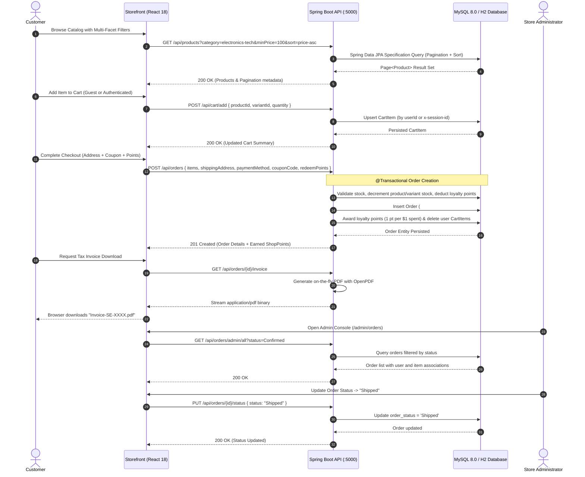

# 01. Project Overview: ShopEase Full-Stack E-Commerce Platform

---

## 1. Executive Summary

**ShopEase** is an enterprise-grade, full-stack digital commerce web platform engineered to deliver an ultra-responsive, modern shopping experience for consumers and an operational back-office console for store administrators.

The application is built on a decoupled, production-ready architecture:
* **Frontend Tier:** **React 18** Single-Page Application (SPA) powered by **Vite**, styled with **Tailwind CSS**, utilizing **React Router DOM v6** (with role-based route guards), **Lucide React Icons**, **Recharts** for real-time sales telemetry, **Canvas Confetti** for checkout celebrations, and **Axios** for centralized API orchestration with request/response interceptors.
* **Backend Application Tier:** **Java 21** with **Spring Boot 3.3.3** (REST API), featuring **Spring Data JPA / Hibernate** for relational ORM, **Spring Security 6** with **JJWT 0.12.6** (stateless JWT token authentication), **OpenPDF** (LibrePDF) for on-the-fly streaming of official tax invoices, **SpringDoc OpenAPI 3 / Swagger UI** for interactive API documentation, and **HikariCP** connection pooling. *(A companion Node.js / Express.js REST backend with Sequelize ORM and PDFKit is also provided as a secondary runtime).*
* **Data Persistence Tier:** **MySQL 8.0** relational database with transactional integrity and foreign key constraints, equipped with an embedded zero-configuration **H2 Database** (Spring Boot `dev` profile) and **SQLite** fallback for instantaneous out-of-the-box local developer onboarding and automated testing.

```
+---------------------------------------------------------------------------------------------------------------+
|                                         SHOPEASE PLATFORM TOPOLOGY                                            |
+---------------------------------------------------------------------------------------------------------------+
|                                                                                                               |
|   +---------------------------------------+             +---------------------------------------+             |
|   |         Customer Storefront UI        |             |         Admin Back-Office UI          |             |
|   |      (React 18 + Vite + Tailwind)     |             |     (React 18 + Vite + Recharts)      |             |
|   |          http://localhost:3000        |             |      http://localhost:3000/admin      |             |
|   +-------------------+-------------------+             +-------------------+-------------------+             |
|                       |                                                     |                                 |
|                       |            HTTPS / JSON REST API Communication      |                                 |
|                       +--------------------------+  +-----------------------+                                 |
|                                                  |  |                                                         |
|                                                  v  v                                                         |
|                       +-------------------------------------------------------+                               |
|                       |             Backend REST API Server (:5000)           |                               |
|                       |     * Java 21 + Spring Boot 3.3.3 (Primary Engine)    |                               |
|                       |     * Spring Data JPA + Hibernate ORM                 |                               |
|                       |     * Spring Security 6 + JJWT 0.12.6 (Stateless)     |                               |
|                       |     * OpenPDF Streaming Tax Invoices                  |                               |
|                       |     * SpringDoc OpenAPI 3 Docs (/swagger-ui.html)     |                               |
|                       +---------------------------+---------------------------+                               |
|                                                   |                                                           |
|                                                   | HikariCP JDBC Connection Pool                             |
|                                                   v                                                           |
|                       +-------------------------------------------------------+                               |
|                       |         Relational Database Persistence Layer         |                               |
|                       |   * Production: MySQL 8.0 (shopease_db)               |                               |
|                       |   * Zero-Config Dev: H2 Database / SQLite Embedded    |                               |
|                       +-------------------------------------------------------+                               |
+---------------------------------------------------------------------------------------------------------------+
```

---

## 2. Business Objectives & Operational Solutions

### 2.1 Core E-Commerce Challenges Addressed
1. **Cart Abandonment & Friction:** Disconnected guest sessions and cumbersome logins cause shoppers to drop out before checkout.
2. **Inventory Inaccuracies & Overselling:** Race conditions during high-concurrency checkout can oversell limited-stock items.
3. **Operational Blindspots for Store Admins:** Absence of real-time sales telemetry, low-inventory radars, and one-click account moderation tools.
4. **Tax & Invoicing Overhead:** Inability to instantly generate legally compliant, downloadable tax invoices.

### 2.2 ShopEase Engineering Solutions
* **Dual-State Database Cart Synchronization:** Seamless database-backed shopping cart storing items for authenticated users (`user_id`) and anonymous visitors (`x-session-id`), with automated 1-click cart migration (`POST /api/cart/merge`) executed immediately upon login.
* **Atomic Inventory Decrement & Order Creation:** Transactional database operations guarantee that product stock is verified, reserved, and decremented atomically during checkout, and automatically replenished upon order cancellation.
* **4-Step Checkout with Loyalty Engine:** Multi-step wizard supporting coupon discount vouchers (`SAVE10`, `WELCOME20`, `FREESHIP`), loyalty points redemption (`100 points = $10 discount`), and multiple payment methods (Razorpay test gateway, Cash on Delivery, UPI simulator, and Card simulation).
* **On-the-Fly Vector PDF Invoicing:** High-performance server-side PDF generation using OpenPDF, streaming structured invoices with company branding, customer billing snapshots, itemized breakdowns, and tax calculations.
* **Executive Administrative Cockpit:** Complete back-office suite at `/admin` featuring real-time GMV counters, Recharts sales revenue charts, low-stock warning radars ($\le 10$ units), product/category CRUD with file uploads, order fulfillment state machine, and customer account moderation.

---

## 3. Target User Personas & Roles

| Persona | Role Identifier | Responsibilities & System Capabilities |
| :--- | :--- | :--- |
| **Online Shopper** | `customer` | Browse catalog, apply multi-facet filters & dynamic sorting, manage wishlist and cart, apply discount coupons, redeem loyalty points, complete checkout, track real-time fulfillment timelines, download PDF tax invoices, and submit 5-star verified reviews. |
| **Store Administrator** | `admin` | Access secure `/admin` back-office, monitor real-time revenue KPIs and sales charts, create/update/delete products and categories with image uploads, manage coupon campaigns, advance order fulfillment statuses (`Confirmed` $\rightarrow$ `Shipped` $\rightarrow$ `Delivered`), and moderate user accounts (Block/Unblock, Role elevation). |

---

## 4. Application Architecture & Package Breakdown

```
                                  +------------------------------+
                                  |     SHOPEASE PLATFORM        |
                                  +--------------+---------------+
                                                 |
             +-----------------------------------+-----------------------------------+
             |                                   |                                   |
             v                                   v                                   v
+--------------------------+        +--------------------------+        +--------------------------+
|  Customer Storefront UI  |        |    Admin Back-Office UI  |        |    Spring Boot Backend   |
+--------------------------+        +--------------------------+        +--------------------------+
| * Auth, Profile, Address |        | * Executive KPI Overview |        | * 12 REST Controllers    |
| * Multi-Facet Catalog    |        | * Recharts Sales Graphs  |        | * 11 Business Services   |
| * PDP Gallery & Video    |        | * Product CRUD + Uploads |        | * 11 JPA Repositories    |
| * DB Cart & Guest Sync   |        | * Category Hierarchy     |        | * 11 JPA Entities        |
| * Wishlist & Move-to-Cart|        | * Order Fulfillment Hub  |        | * Spring Security 6 JJWT |
| * 4-Step Checkout Wizard |        | * Coupon Engine Manager  |        | * OpenPDF Invoice Engine |
| * Real-Time Order Track  |        | * User Moderation (Block)|        | * Database Seeder Service|
| * PDF Invoice Downloader |        | * Role Elevation Toggle  |        | * SpringDoc OpenAPI 3 UI |
+--------------------------+        +--------------------------+        +--------------------------+
```

---

## 5. End-to-End Business Workflow



---

## 6. Project Scope & Architecture Classification

* **Implemented Core Features:**
  - **Full Authentication & Profile Management:** Registration, Login, stateless JWT tokens, BCrypt password hashing, Forgot/Reset password flows, and multi-address book management with default address designation.
  - **Comprehensive Catalog Engine:** Keyword search, category slug/ID filter, commercial brand catalog (Samsung, Apple, Sony, Nike, Adidas, etc.), price range slider ($10 - $500), star rating filter, in-stock toggle, and dynamic sorting.
  - **Rich Product Detail Page (PDP):** Multi-image thumbnail gallery, video showcase (`videoUrl`), SKU variant selector, stock alert badges, and 5-star customer review submission with instant average rating recalculation.
  - **Dual-State Database Cart & Wishlist:** Persistent database cart for authenticated users and anonymous guests using `x-session-id`, automatic 1-click cart migration upon login, and wishlist with move-to-cart.
  - **4-Step Checkout & Loyalty Engine:** Step-by-step wizard, address snapshotting, coupon validation engine (`SAVE10`, `WELCOME20`, `FREESHIP`), loyalty points redemption (100 points = $10), and multi-payment selection (Razorpay test mode, COD, UPI simulator, Card).
  - **Order Fulfillment & Invoicing:** 4-stage tracking timeline (`Pending` $\rightarrow$ `Confirmed` $\rightarrow$ `Shipped` $\rightarrow$ `Delivered`), cancellation with automatic inventory restock, and on-the-fly PDF tax invoice streaming.
  - **Admin Back-Office Suite:** Executive dashboard with real-time KPI metrics, monthly sales revenue charts (Recharts), low-stock warning radars, product CRUD with multipart image uploads, category hierarchy manager, order fulfillment hub, user directory moderation (Block/Unblock, Role toggle), and promo coupon creator.
  - **Interactive API Documentation:** SpringDoc OpenAPI 3 / Swagger UI available at `http://localhost:5000/swagger-ui.html` and `http://localhost:5000/api-docs`.
* **Current Architectural Classification:**
  - **Backend:** Layered 3-Tier Monolithic REST Architecture (Controllers $\rightarrow$ Services $\rightarrow$ Repositories $\rightarrow$ JPA Entities).
  - **Frontend:** Component-driven Single-Page Application (SPA) with Context API state management.
* **Recommended Production Enhancements:**
  - Distributed Redis caching for high-velocity catalog endpoints.
  - OAuth2 Social Login (Google, GitHub).
  - WebSockets / Server-Sent Events (SSE) for live order status push notifications.
  - Refresh token rotation with HttpOnly cookies.
