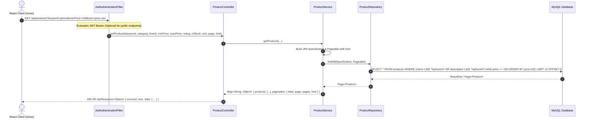

# 04. System Architecture & Component Design

---

## 1. System Topology & Architectural Paradigm

ShopEase is built on a **Decoupled Full-Stack Web Architecture** comprising an independent React Single-Page Application (SPA) frontend and a modular, layered Spring Boot REST API backend communicating with a relational database managed via Spring Data JPA / Hibernate.

```
+---------------------------------------------------------------------------------------------------------------+
|                                         SHOPEASE SYSTEM ARCHITECTURE                                          |
+---------------------------------------------------------------------------------------------------------------+
|                                                                                                               |
|  [ FRONTEND TIER (React 18 + Vite + Tailwind CSS) ]                                                           |
|  * Port: http://localhost:3000                                                                                |
|  * Router: React Router DOM v6 with <ProtectedRoute> and <AdminRoute> guards                                 |
|  * State: React Context (AuthContext, CartContext, WishlistContext, ToastContext)                             |
|  * API Client: Axios instance (services/api.js) with Bearer token & x-session-id interceptors                 |
|                                                                                                               |
|                                       |                                                                       |
|                                       | HTTPS / HTTP REST API (JSON Payloads)                                 |
|                                       v                                                                       |
|                                                                                                               |
|  [ BACKEND APPLICATION TIER (Java 21 + Spring Boot 3.3.3 REST API) ]                                          |
|  * Port: http://localhost:5000                                                                                |
|  * Security Layer: Spring Security 6 (Stateless Session) + JJWT 0.12.6 Filter Chain (JwtAuthenticationFilter) |
|  * Controller Layer: 12 RestControllers (@RestController, @RequestMapping("/api/*"))                          |
|  * Service Layer: 11 Business Services (@Service, @Transactional for ACID order & cart operations)            |
|  * Invoicing Engine: OpenPDF (com.github.librepdf:openpdf) streaming vector PDF invoices                     |
|  * API Specification: SpringDoc OpenAPI 3 / Swagger UI (/swagger-ui.html & /api-docs)                        |
|                                                                                                               |
|                                       |                                                                       |
|                                       | Spring Data JPA / Hibernate ORM (HikariCP Connection Pool)            |
|                                       v                                                                       |
|                                                                                                               |
|  [ DATA PERSISTENCE TIER (Relational Database) ]                                                              |
|  * Production: MySQL 8.0 (InnoDB Engine, UTF-8 MB4, Foreign Keys, Connection Pool)                           |
|  * Development Fallback: Embedded H2 Database (database_h2.mv.db) / SQLite (database.sqlite)                   |
+---------------------------------------------------------------------------------------------------------------+
```

---

## 2. Frontend Architecture (React 18 + Vite)

The frontend application follows a structured, component-driven layout designed for maintainability and performance:

```text
frontend/src/
├── assets/                  # Static SVG icons and graphics
├── components/              # Reusable UI component modules
│   ├── admin/               # AdminLayout, AdminSidebar, MetricCards
│   ├── cart/                # CartDrawer, CartItemRow, ShippingProgressBar
│   ├── common/              # Navbar, Footer, StarRating, Badge, BrandMarquee, BrandSpotlightAd, AllBrandsShowcase
│   ├── product/             # ProductCard, ProductGrid, ImageGallery
│   └── routes/              # ProtectedRoute.jsx, AdminRoute.jsx
├── context/                 # Global application state providers
│   ├── AuthContext.jsx      # User profile, JWT token, login, logout, register, auto-cart merge
│   ├── CartContext.jsx      # Cart items, subtotal, shipping tracker, DB synchronization
│   ├── WishlistContext.jsx  # Wishlist items, toggle in/out, move-to-cart
│   └── ToastContext.jsx     # Global toast notification queue
├── pages/                   # Route-level page components
│   ├── Home.jsx             # Hero banner, featured/trending carousels, brand grid
│   ├── Products.jsx         # Catalog with faceted sidebar filters & dynamic sorting
│   ├── ProductDetails.jsx   # Rich PDP with gallery, video, variant picker, reviews
│   ├── Cart.jsx             # Dedicated full shopping cart page
│   ├── Checkout.jsx         # 4-step checkout wizard with coupon & points redemption
│   ├── OrderConfirmation.jsx# Post-purchase confetti screen & order summary
│   ├── OrderHistory.jsx     # Customer orders list with live status badges
│   ├── OrderDetails.jsx     # Detailed order view with 4-stage tracking timeline & invoice download
│   ├── Profile.jsx          # Profile info & saved address book manager
│   ├── Login.jsx            # Authentication form with quick-fill demo buttons
│   ├── Register.jsx         # Customer registration form
│   ├── ForgotPassword.jsx   # Password reset request form
│   ├── ResetPassword.jsx    # Password reset submission form
│   ├── NotFound.jsx         # 404 error page
│   └── admin/               # Dedicated admin console pages
│       ├── AdminDashboard.jsx   # KPI metric cards & Recharts revenue/order graphs
│       ├── AdminProducts.jsx    # Product CRUD table & image upload modal
│       ├── AdminCategories.jsx  # Category department manager
│       ├── AdminOrders.jsx      # Order fulfillment pipeline & inspector modal
│       ├── AdminUsers.jsx       # User directory with block & role toggles
│       └── AdminCoupons.jsx     # Promo coupon creator & toggle
├── services/
│   └── api.js               # Centralized Axios client instance with interceptors & endpoints
├── utils/
│   └── currency.js          # Currency formatting utilities
├── App.jsx                  # Main layout wrapper, routing tree, and context providers
└── main.jsx                 # React DOM entrypoint
```

---

## 3. Backend Architecture (Java 21 + Spring Boot 3.3.3)

The backend follows an enterprise **3-Tier Layered Monolith Architecture**:

```text
backend/src/main/java/com/shopease/
├── ShopEaseApplication.java # Spring Boot application bootstrap
├── config/
│   ├── OpenApiConfig.java       # SpringDoc OpenAPI 3 configuration
│   ├── WebMvcConfig.java        # Static resource mapping (/uploads/**) & CORS defaults
│   └── WebSecurityConfig.java   # Spring Security 6 filter chain, CORS bean & password encoder
├── controller/                  # REST Controllers exposing @RequestMapping endpoints
│   ├── AdminController.java     # /api/admin (Dashboard stats, users list, block/role toggles, coupons)
│   ├── AuthController.java      # /api/auth (Register, login, profile, forgot/reset password, addresses)
│   ├── CartController.java      # /api/cart (Get, add, update, remove, clear, merge guest cart)
│   ├── CategoryController.java  # /api/categories (CRUD for merchandise taxonomy)
│   ├── HealthController.java    # / & /api/health (System health status & version metadata)
│   ├── OrderController.java     # /api/orders (Create order, user orders, admin all, cancel, PDF invoice)
│   ├── PaymentController.java   # /api/payment (Validate coupon, Razorpay order creation & verification)
│   ├── ProductController.java   # /api/products (Faceted catalog search, featured, trending, brands, CRUD)
│   ├── ReviewController.java    # /api/reviews (Product reviews & average rating recalculation)
│   ├── UploadController.java    # /api/upload (Multipart single & multiple image file storage)
│   ├── WebhookController.java   # /api/webhooks (Razorpay payment event listener)
│   └── WishlistController.java  # /api/wishlist (Get, toggle, remove, move-to-cart)
├── dto/                         # Data Transfer Objects & standard API response envelopes
│   ├── ApiResponse.java         # Standard { success, message, data, ... } response wrapper
│   ├── AuthDtos.java            # LoginRequest, RegisterRequest, AuthResponse, AddressRequest
│   ├── CartDtos.java            # AddToCartRequest, UpdateCartItemRequest, CartResponse, CartItemResponse
│   ├── OrderDtos.java           # CheckoutRequest, OrderStatusUpdateRequest, Payment requests
│   └── ProductDtos.java         # ProductCreateUpdateRequest, CouponRequest, ReviewCreateRequest
├── entity/                      # JPA Entities mapped to relational database tables
│   ├── Address.java             # mapped to 'addresses'
│   ├── CartItem.java            # mapped to 'cart_items'
│   ├── Category.java            # mapped to 'categories'
│   ├── Coupon.java              # mapped to 'coupons'
│   ├── Order.java               # mapped to 'orders'
│   ├── OrderItem.java           # mapped to 'order_items'
│   ├── Product.java             # mapped to 'products'
│   ├── ProductVariant.java      # mapped to 'product_variants'
│   ├── Review.java              # mapped to 'reviews'
│   ├── User.java                # mapped to 'users'
│   └── WishlistItem.java        # mapped to 'wishlist_items'
├── repository/                  # Spring Data JPA Repositories
│   ├── AddressRepository.java, CartItemRepository.java, CategoryRepository.java,
│   ├── CouponRepository.java, OrderItemRepository.java, OrderRepository.java,
│   ├── ProductRepository.java, ProductVariantRepository.java, ReviewRepository.java,
│   ├── UserRepository.java, WishlistItemRepository.java
├── security/                    # Security components
│   ├── CustomUserDetailsService.java # UserDetails loader by email/ID
│   ├── JwtAuthenticationFilter.java  # OncePerRequestFilter parsing Bearer token
│   ├── JwtTokenProvider.java         # JJWT token creation, validation & claim extraction
│   └── UserPrincipal.java            # UserDetails implementation holding role & permissions
└── service/                     # Business Logic & Transactions (@Transactional)
    ├── AdminService.java        # Dashboard KPI metrics, monthly sales aggregation, user moderation
    ├── AuthService.java         # Authentication, registration, address book management
    ├── CartService.java         # Cart operations, stock boundary enforcement, guest cart merge
    ├── CategoryService.java     # Category operations & slug generation
    ├── DatabaseSeederService.java# CommandLineRunner seeding initial demo users, products, coupons
    ├── InvoiceService.java      # OpenPDF vector tax invoice generation
    ├── OrderService.java        # Order placement, atomic stock deduction, cancellation restock
    ├── PaymentService.java      # Coupon validation, discount computation, Razorpay order simulator
    ├── ProductService.java      # JPA Specification dynamic multi-facet filtering & sorting
    ├── ReviewService.java       # Review submission & average rating recalculation
    └── WishlistService.java     # Wishlist persistence & move-to-cart operations
```

---

## 4. End-to-End Request-Response Lifecycle



---

## 5. Global Error Handling & Standard API Envelope

All backend endpoints respond using a standardized `ApiResponse<T>` envelope:

```java
// dto/ApiResponse.java
@Data
@Builder
@NoArgsConstructor
@AllArgsConstructor
@JsonInclude(JsonInclude.Include.NON_NULL)
public class ApiResponse<T> {
    private boolean success;
    private String message;
    private T data;
    private Integer earned_points;
    private String url;

    public static <T> ApiResponse<T> success(T data) {
        return ApiResponse.<T>builder().success(true).data(data).build();
    }

    public static <T> ApiResponse<T> success(T data, String message) {
        return ApiResponse.<T>builder().success(true).message(message).data(data).build();
    }

    public static <T> ApiResponse<T> error(String message) {
        return ApiResponse.<T>builder().success(false).message(message).build();
    }
}
```
