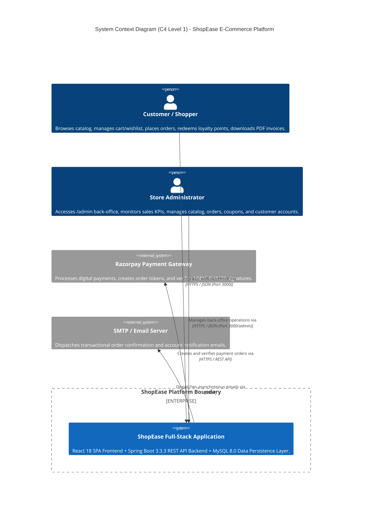
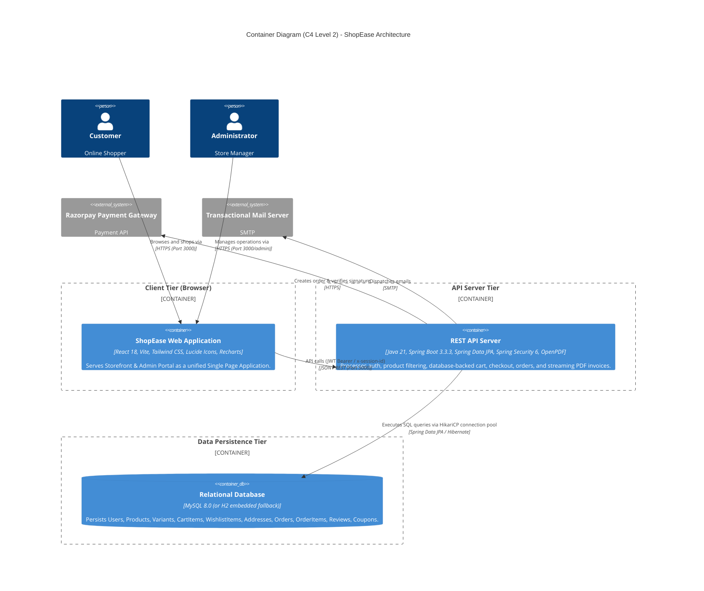
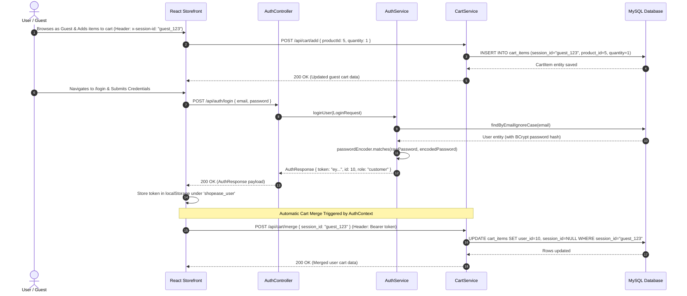
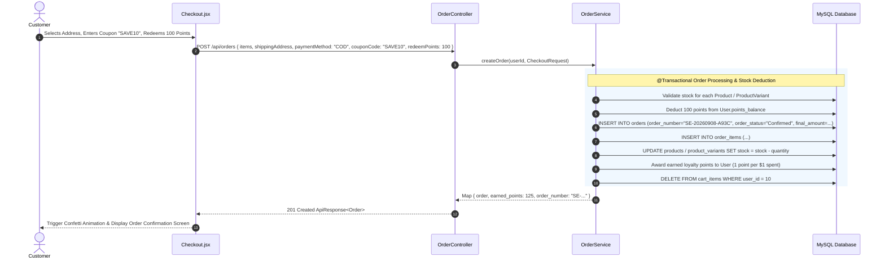

# 05. High-Level Design (HLD)

---

## 1. System Context Diagram (C4 Model - Level 1)

The System Context diagram illustrates the boundaries of the ShopEase platform and its interactions with human actors and external services.



---

## 2. Container Diagram (C4 Model - Level 2)

The Container Diagram illustrates the high-level technology containers comprising ShopEase.



---

## 3. Component Architecture Breakdown

```
+---------------------------------------------------------------------------------------------------------------+
|                                       COMPONENT ARCHITECTURE BREAKDOWN                                        |
+---------------------------------------------------------------------------------------------------------------+
|                                                                                                               |
|  [ FRONTEND COMPONENTS (React 18 + Vite) ]                                                                    |
|  * Context Layer:                                                                                             |
|    - AuthContext: Manages user profile, JWT token in localStorage, login, logout, auto-cart merge             |
|    - CartContext: Synchronizes with /api/cart, controls cart drawer, shipping progress tracker               |
|    - WishlistContext: Handles wishlist state and move-to-cart operations                                      |
|    - ToastContext: Global floating notification queue                                                         |
|  * Routing & Security:                                                                                        |
|    - AppLayout (React Router DOM v6)                                                                          |
|    - ProtectedRoute: Verifies active JWT token, redirects unauthenticated requests to /login                  |
|    - AdminRoute: Verifies user role === 'admin', blocks unauthorized access                                  |
|  * Service Client Layer:                                                                                      |
|    - api.js: Central Axios instance with Bearer token injection and guest x-session-id persistence            |
|                                                                                                               |
|  [ BACKEND COMPONENTS (Java 21 + Spring Boot 3.3.3) ]                                                         |
|  * Controller Layer: 12 @RestControllers mounted on /api/*                                                    |
|  * Security Pipeline:                                                                                         |
|    - JwtAuthenticationFilter: Decodes Bearer token, loads UserPrincipal, verifies isBlocked status           |
|    - WebSecurityConfig: Stateless SecurityFilterChain with role-based URL matchers (/api/admin/**)           |
|  * Business Services:                                                                                         |
|    - AuthService, ProductService, CartService, OrderService, PaymentService, AdminService,                     |
|      CategoryService, ReviewService, WishlistService, InvoiceService (OpenPDF), DatabaseSeederService         |
|                                                                                                               |
|  [ DATA LAYER (Spring Data JPA / Hibernate) ]                                                                 |
|  * JPA Entities: User, Address, Category, Product, ProductVariant, CartItem, WishlistItem, Order,            |
|    OrderItem, Review, Coupon                                                                                  |
|  * Repositories: JpaRepository interfaces with custom JPQL queries & Specifications                          |
+---------------------------------------------------------------------------------------------------------------+
```

---

## 4. End-to-End Architectural Sequence Diagrams

### 4.1 Authentication & Guest Cart Merge Flow



---

### 4.2 Multi-Step Checkout & Atomic Stock Deduction Sequence



---

### 4.3 Streaming Vector PDF Tax Invoice Flow

```mermaid
sequenceDiagram
    autonumber
    actor Customer as Customer
    participant React as React UI
    participant OrderCtrl as OrderController
    participant InvoiceSvc as InvoiceService (OpenPDF)
    participant DB as MySQL Database

    Customer->>React: Clicks "Download Tax Invoice (PDF)"
    React->>OrderCtrl: GET /api/orders/{id}/invoice (Header: Bearer token)
    OrderCtrl->>DB: findById(orderId) with OrderItems & User
    DB-->>OrderCtrl: Order Entity Graph
    OrderCtrl->>InvoiceSvc: generateInvoicePdf(order, user)
    InvoiceSvc->>InvoiceSvc: Build OpenPDF Document with Tables, Styling & Tax Summary
    InvoiceSvc-->>OrderCtrl: byte[] pdfBytes
    OrderCtrl-->>React: Stream application/pdf (Header: Content-Disposition: attachment; filename="Invoice-SE-XXXX.pdf")
    React-->>Customer: Browser triggers download "Invoice-SE-XXXX.pdf"
```
