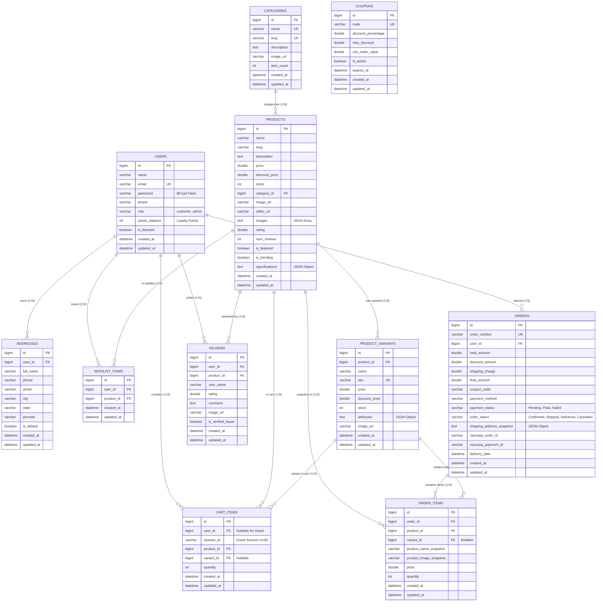

# 07. Database Design & Relational Schema (MySQL 8.0 / JPA)

---

## 1. Entity Relationship Diagram (ERD)

The database schema comprises **11 relational tables** mapped to Spring Data JPA entities:



---

## 2. Complete Relational Data Dictionary

| Table Name | JPA Entity | Description | Key Indexes & Constraints |
| :--- | :--- | :--- | :--- |
| `users` | `User.java` | Shopper & Admin credentials, loyalty points balance (`points_balance`), and moderation flag (`is_blocked`). | `PRIMARY KEY (id)`, `UNIQUE (email)` |
| `categories` | `Category.java` | Product department taxonomy with aggregated `item_count`. | `PRIMARY KEY (id)`, `UNIQUE (name)`, `UNIQUE (slug)` |
| `products` | `Product.java` | Catalog merchandise with embedded JSON arrays for `images` and JSON objects for `specifications`. | `PRIMARY KEY (id)`, `FOREIGN KEY (category_id)` |
| `product_variants` | `ProductVariant.java`| SKU-level variants (size/color matrix) with distinct price and stock. | `PRIMARY KEY (id)`, `UNIQUE (sku)`, `FOREIGN KEY (product_id)` |
| `cart_items` | `CartItem.java` | Database shopping cart linked to `user_id` or guest `session_id`. | `PRIMARY KEY (id)`, `FOREIGN KEY (user_id)`, `FOREIGN KEY (product_id)` |
| `wishlist_items` | `WishlistItem.java`| Customer saved items for future purchase. | `PRIMARY KEY (id)`, `FOREIGN KEY (user_id)`, `FOREIGN KEY (product_id)` |
| `addresses` | `Address.java` | Saved delivery addresses with `is_default` designation. | `PRIMARY KEY (id)`, `FOREIGN KEY (user_id)` |
| `orders` | `Order.java` | Master order headers with frozen JSON snapshot of shipping destination. | `PRIMARY KEY (id)`, `UNIQUE (order_number)`, `FOREIGN KEY (user_id)` |
| `order_items` | `OrderItem.java` | Order line item snapshots preserving purchase price and product name at checkout. | `PRIMARY KEY (id)`, `FOREIGN KEY (order_id)` |
| `reviews` | `Review.java` | 1-to-5 star customer feedback and ratings. | `PRIMARY KEY (id)`, `FOREIGN KEY (user_id)`, `FOREIGN KEY (product_id)` |
| `coupons` | `Coupon.java` | Promotional discount vouchers with percentage rules and expiration dates. | `PRIMARY KEY (id)`, `UNIQUE (code)` |

---

## 3. Production MySQL 8.0 DDL (Create Table Script)

```sql
-- =============================================================================
-- ShopEase E-Commerce Relational Schema (MySQL 8.0 / InnoDB)
-- =============================================================================

CREATE DATABASE IF NOT EXISTS shopease_db
  CHARACTER SET utf8mb4
  COLLATE utf8mb4_unicode_ci;

USE shopease_db;

-- 1. Users Table
CREATE TABLE IF NOT EXISTS users (
    id BIGINT AUTO_INCREMENT PRIMARY KEY,
    name VARCHAR(255) NOT NULL,
    email VARCHAR(255) NOT NULL UNIQUE,
    password VARCHAR(255) NOT NULL,
    phone VARCHAR(255) NULL,
    role VARCHAR(50) NOT NULL DEFAULT 'customer',
    points_balance INT NOT NULL DEFAULT 100,
    is_blocked BOOLEAN NOT NULL DEFAULT FALSE,
    created_at DATETIME NOT NULL DEFAULT CURRENT_TIMESTAMP,
    updated_at DATETIME NOT NULL DEFAULT CURRENT_TIMESTAMP ON UPDATE CURRENT_TIMESTAMP,
    INDEX idx_users_email (email),
    INDEX idx_users_role (role)
) ENGINE=InnoDB;

-- 2. Categories Table
CREATE TABLE IF NOT EXISTS categories (
    id BIGINT AUTO_INCREMENT PRIMARY KEY,
    name VARCHAR(255) NOT NULL UNIQUE,
    slug VARCHAR(255) NOT NULL UNIQUE,
    description TEXT NULL,
    image_url VARCHAR(255) NULL,
    item_count INT NOT NULL DEFAULT 0,
    created_at DATETIME NOT NULL DEFAULT CURRENT_TIMESTAMP,
    updated_at DATETIME NOT NULL DEFAULT CURRENT_TIMESTAMP ON UPDATE CURRENT_TIMESTAMP,
    INDEX idx_categories_slug (slug)
) ENGINE=InnoDB;

-- 3. Products Table
CREATE TABLE IF NOT EXISTS products (
    id BIGINT AUTO_INCREMENT PRIMARY KEY,
    name VARCHAR(255) NOT NULL,
    slug VARCHAR(255) NOT NULL,
    description TEXT NOT NULL,
    price DOUBLE NOT NULL,
    discount_price DOUBLE NULL,
    stock INT NOT NULL DEFAULT 0,
    category_id BIGINT NOT NULL,
    image_url VARCHAR(255) NOT NULL,
    video_url VARCHAR(255) NULL,
    images TEXT NULL, -- JSON Stringified Array
    rating DOUBLE NOT NULL DEFAULT 0.0,
    num_reviews INT NOT NULL DEFAULT 0,
    is_featured BOOLEAN NOT NULL DEFAULT FALSE,
    is_trending BOOLEAN NOT NULL DEFAULT FALSE,
    specifications TEXT NULL, -- JSON Stringified Object
    created_at DATETIME NOT NULL DEFAULT CURRENT_TIMESTAMP,
    updated_at DATETIME NOT NULL DEFAULT CURRENT_TIMESTAMP ON UPDATE CURRENT_TIMESTAMP,
    CONSTRAINT fk_products_category FOREIGN KEY (category_id) REFERENCES categories(id) ON DELETE CASCADE,
    INDEX idx_products_category (category_id),
    INDEX idx_products_price (price),
    INDEX idx_products_rating (rating),
    INDEX idx_products_featured (is_featured),
    INDEX idx_products_trending (is_trending)
) ENGINE=InnoDB;

-- 4. Product Variants Table
CREATE TABLE IF NOT EXISTS product_variants (
    id BIGINT AUTO_INCREMENT PRIMARY KEY,
    product_id BIGINT NOT NULL,
    name VARCHAR(255) NOT NULL,
    sku VARCHAR(255) NOT NULL UNIQUE,
    price DOUBLE NOT NULL,
    discount_price DOUBLE NULL,
    stock INT NOT NULL DEFAULT 0,
    attributes TEXT NULL, -- JSON Object (e.g. {"color":"Black","size":"M"})
    image_url VARCHAR(255) NULL,
    created_at DATETIME NOT NULL DEFAULT CURRENT_TIMESTAMP,
    updated_at DATETIME NOT NULL DEFAULT CURRENT_TIMESTAMP ON UPDATE CURRENT_TIMESTAMP,
    CONSTRAINT fk_variants_product FOREIGN KEY (product_id) REFERENCES products(id) ON DELETE CASCADE,
    INDEX idx_variants_product (product_id),
    INDEX idx_variants_sku (sku)
) ENGINE=InnoDB;

-- 5. Cart Items Table
CREATE TABLE IF NOT EXISTS cart_items (
    id BIGINT AUTO_INCREMENT PRIMARY KEY,
    user_id BIGINT NULL,
    session_id VARCHAR(255) NULL,
    product_id BIGINT NOT NULL,
    variant_id BIGINT NULL,
    quantity INT NOT NULL DEFAULT 1,
    created_at DATETIME NOT NULL DEFAULT CURRENT_TIMESTAMP,
    updated_at DATETIME NOT NULL DEFAULT CURRENT_TIMESTAMP ON UPDATE CURRENT_TIMESTAMP,
    CONSTRAINT fk_cart_user FOREIGN KEY (user_id) REFERENCES users(id) ON DELETE CASCADE,
    CONSTRAINT fk_cart_product FOREIGN KEY (product_id) REFERENCES products(id) ON DELETE CASCADE,
    CONSTRAINT fk_cart_variant FOREIGN KEY (variant_id) REFERENCES product_variants(id) ON DELETE CASCADE,
    INDEX idx_cart_user (user_id),
    INDEX idx_cart_session (session_id)
) ENGINE=InnoDB;

-- 6. Wishlist Items Table
CREATE TABLE IF NOT EXISTS wishlist_items (
    id BIGINT AUTO_INCREMENT PRIMARY KEY,
    user_id BIGINT NOT NULL,
    product_id BIGINT NOT NULL,
    created_at DATETIME NOT NULL DEFAULT CURRENT_TIMESTAMP,
    updated_at DATETIME NOT NULL DEFAULT CURRENT_TIMESTAMP ON UPDATE CURRENT_TIMESTAMP,
    CONSTRAINT fk_wishlist_user FOREIGN KEY (user_id) REFERENCES users(id) ON DELETE CASCADE,
    CONSTRAINT fk_wishlist_product FOREIGN KEY (product_id) REFERENCES products(id) ON DELETE CASCADE,
    INDEX idx_wishlist_user (user_id)
) ENGINE=InnoDB;

-- 7. Addresses Table
CREATE TABLE IF NOT EXISTS addresses (
    id BIGINT AUTO_INCREMENT PRIMARY KEY,
    user_id BIGINT NOT NULL,
    full_name VARCHAR(255) NOT NULL,
    phone VARCHAR(255) NOT NULL,
    street VARCHAR(255) NOT NULL,
    city VARCHAR(255) NOT NULL,
    state VARCHAR(255) NOT NULL,
    pincode VARCHAR(255) NOT NULL,
    is_default BOOLEAN NOT NULL DEFAULT FALSE,
    created_at DATETIME NOT NULL DEFAULT CURRENT_TIMESTAMP,
    updated_at DATETIME NOT NULL DEFAULT CURRENT_TIMESTAMP ON UPDATE CURRENT_TIMESTAMP,
    CONSTRAINT fk_addresses_user FOREIGN KEY (user_id) REFERENCES users(id) ON DELETE CASCADE,
    INDEX idx_addresses_user (user_id)
) ENGINE=InnoDB;

-- 8. Orders Table
CREATE TABLE IF NOT EXISTS orders (
    id BIGINT AUTO_INCREMENT PRIMARY KEY,
    order_number VARCHAR(255) NOT NULL UNIQUE,
    user_id BIGINT NOT NULL,
    total_amount DOUBLE NOT NULL,
    discount_amount DOUBLE NOT NULL DEFAULT 0.0,
    shipping_charge DOUBLE NOT NULL DEFAULT 0.0,
    final_amount DOUBLE NOT NULL,
    coupon_code VARCHAR(255) NULL,
    payment_method VARCHAR(255) NOT NULL DEFAULT 'COD',
    payment_status VARCHAR(50) NOT NULL DEFAULT 'Pending',
    order_status VARCHAR(50) NOT NULL DEFAULT 'Confirmed',
    shipping_address_snapshot TEXT NOT NULL, -- JSON Object
    razorpay_order_id VARCHAR(255) NULL,
    razorpay_payment_id VARCHAR(255) NULL,
    delivery_date DATETIME NULL,
    created_at DATETIME NOT NULL DEFAULT CURRENT_TIMESTAMP,
    updated_at DATETIME NOT NULL DEFAULT CURRENT_TIMESTAMP ON UPDATE CURRENT_TIMESTAMP,
    CONSTRAINT fk_orders_user FOREIGN KEY (user_id) REFERENCES users(id) ON DELETE CASCADE,
    INDEX idx_orders_user (user_id),
    INDEX idx_orders_number (order_number),
    INDEX idx_orders_status (order_status)
) ENGINE=InnoDB;

-- 9. Order Items Table
CREATE TABLE IF NOT EXISTS order_items (
    id BIGINT AUTO_INCREMENT PRIMARY KEY,
    order_id BIGINT NOT NULL,
    product_id BIGINT NULL,
    variant_id BIGINT NULL,
    product_name_snapshot VARCHAR(255) NOT NULL,
    product_image_snapshot VARCHAR(255) NOT NULL,
    price DOUBLE NOT NULL,
    quantity INT NOT NULL DEFAULT 1,
    created_at DATETIME NOT NULL DEFAULT CURRENT_TIMESTAMP,
    updated_at DATETIME NOT NULL DEFAULT CURRENT_TIMESTAMP ON UPDATE CURRENT_TIMESTAMP,
    CONSTRAINT fk_orderitems_order FOREIGN KEY (order_id) REFERENCES orders(id) ON DELETE CASCADE,
    CONSTRAINT fk_orderitems_product FOREIGN KEY (product_id) REFERENCES products(id) ON DELETE SET NULL,
    CONSTRAINT fk_orderitems_variant FOREIGN KEY (variant_id) REFERENCES product_variants(id) ON DELETE SET NULL,
    INDEX idx_orderitems_order (order_id)
) ENGINE=InnoDB;

-- 10. Reviews Table
CREATE TABLE IF NOT EXISTS reviews (
    id BIGINT AUTO_INCREMENT PRIMARY KEY,
    user_id BIGINT NOT NULL,
    product_id BIGINT NOT NULL,
    user_name VARCHAR(255) NOT NULL,
    rating DOUBLE NOT NULL,
    comment TEXT NOT NULL,
    image_url VARCHAR(255) NULL,
    is_verified_buyer BOOLEAN NOT NULL DEFAULT TRUE,
    created_at DATETIME NOT NULL DEFAULT CURRENT_TIMESTAMP,
    updated_at DATETIME NOT NULL DEFAULT CURRENT_TIMESTAMP ON UPDATE CURRENT_TIMESTAMP,
    CONSTRAINT fk_reviews_user FOREIGN KEY (user_id) REFERENCES users(id) ON DELETE CASCADE,
    CONSTRAINT fk_reviews_product FOREIGN KEY (product_id) REFERENCES products(id) ON DELETE CASCADE,
    INDEX idx_reviews_product (product_id)
) ENGINE=InnoDB;

-- 11. Coupons Table
CREATE TABLE IF NOT EXISTS coupons (
    id BIGINT AUTO_INCREMENT PRIMARY KEY,
    code VARCHAR(255) NOT NULL UNIQUE,
    discount_percentage DOUBLE NOT NULL,
    max_discount DOUBLE NULL,
    min_order_value DOUBLE NOT NULL DEFAULT 0.0,
    is_active BOOLEAN NOT NULL DEFAULT TRUE,
    expires_at DATETIME NULL,
    created_at DATETIME NOT NULL DEFAULT CURRENT_TIMESTAMP,
    updated_at DATETIME NOT NULL DEFAULT CURRENT_TIMESTAMP ON UPDATE CURRENT_TIMESTAMP,
    INDEX idx_coupons_code (code)
) ENGINE=InnoDB;
```
